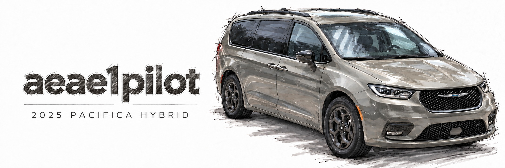

# aeae1pilot: my sunnypilot setup

This is my personal sunnypilot fork for my **2025 Chrysler Pacifica Hybrid and comma 3X**. I'm really happy with how it drives. I'm running **Blue Diamond v2**, a **Laneful** profile, and **NNLC**, with my camera mounted off to the side and the legacy **camera offset set to −20 cm**. I like the camera there, and I like the behavior I've ended up with.

## Install my Pacifica setup on a new comma 3X

**Use the `pacifica` branch for a new or wiped replacement device.** It contains my frozen driving setup, the verified Blue Diamond v2 files, and automatic first-install preferences. My current comma still runs `release-c3`; publishing `pacifica` doesn't switch it over.

1. Connect the replacement comma 3X to reliable power and Wi-Fi. For a used device, wipe the previous setup first using its factory-reset/uninstall procedure.
2. On the setup screen, choose **Custom Software**.
3. Try these installation addresses in order:

| Order | Installer | Enter on the comma |
|---|---|---|
| **1. Try this first** | Shane Smiskol | [smiskol.com/fork/aeae1/pacifica](https://smiskol.com/fork/aeae1/pacifica) |
| **2. If that installer fails** | comma's installer | [installer.comma.ai/aeae1/pacifica](https://installer.comma.ai/aeae1/pacifica) |

Both addresses select the **same `pacifica` branch**. They are alternate ways to download it; changing the installer service won't fix a problem in the installed software itself. There is no separately published custom installer binary.

4. Let the downloads and any required OS installation finish. This frozen software requests **AGNOS 9.6**, including when the replacement currently has a newer OS.
5. On a clean installation, startup verifies and installs all three bundled Blue Diamond files and applies [my saved profile](https://github.com/aeae1/openpilot/blob/pacifica/pacifica/profile.json). There is no separate Blue Diamond download or model-menu selection required.
6. Complete the device's normal onboarding and its own calibration, and pair it with my account if needed. Wi-Fi credentials, SSH keys, device identity, calibration, and learned values aren't copied from the old comma.

The intended first-run selections are **Blue Diamond v2, Laneful, Camera Offset −20 cm, Path Offset 0 cm, NNLC on**, and the preferences documented below. The offset is specific to my existing car/mount arrangement; a replacement still needs its own calibration.

**Validation status:** the initialization logic and real model checksums are tested in software. A full new-device installation, the ARM model runners, the live generated installers, and the OS downgrade have not been verified on a replacement comma 3X. The installer URL formats are [documented by Smiskol](https://github.com/sshane/openpilot-installer-generator) and [comma](https://github.com/commaai/openpilot-release-archive/blob/devel/README.md). This workspace could not reach the installer binaries or legacy OS download URLs, so their live availability is not claimed.

If an OS downgrade leaves startup stuck at registration, check Wi-Fi: comma has [documented a network-configuration issue when downgrading AGNOS](https://github.com/commaai/agnos-builder/issues/423). That's a separate issue from Blue Diamond or the preference profile. For a device that cannot reach normal setup, comma's official factory reflashing route is [flash.comma.ai](https://flash.comma.ai/); it is not an image of my personal setup or a claim that it installs AGNOS 9.6.

### Fall back to my original setup

If I need the original frozen software instead of the new installation support, use **`release-c3`**, not `release3`:

| Order | Original-version installer |
|---|---|
| **1. Smiskol** | [smiskol.com/fork/aeae1/release-c3](https://smiskol.com/fork/aeae1/release-c3) |
| **2. comma** | [installer.comma.ai/aeae1/release-c3](https://installer.comma.ai/aeae1/release-c3) |

This installs the original software, **without automatic Blue Diamond or preference restoration**. Finish onboarding, select/download **Blue Diamond v2 (December 12, 2023)** in its driving-model menu, then reapply the settings below. If the original model download is unavailable, the [pinned archive](https://github.com/aeae1/openpilot/tree/70f4db9d01be4ceb3706c508484055f615e0fa0a/backups/blue-diamond-v2) contains the three files, their checksums, the required model directory, and the six selection values documented in this README. A manual restore of those files/values requires parked-device SSH/SFTP access and a reboot before use. No custom installer is provided for the old branch.

The setup is pretty much frozen in time, and I'm fine with that. I'm curious whether newer driving models might feel a little nicer, but I don't feel a need to upgrade just for a newer version number. My priority is to preserve what I already like and make any future changes deliberately.

**The branch on my current device is [`release-c3`](https://github.com/aeae1/openpilot/tree/release-c3).** The new [`pacifica`](https://github.com/aeae1/openpilot/tree/pacifica) branch adds first-install setup to that same driving-code baseline. GitHub's default branch, `master`, is a different historical source tree. This README documents both of my deployment branches even when viewed on `master`; the surrounding code on `master` doesn't contain these changes.

I made the original changes with a mix of AI help and manual work, with plenty of edits and reversions along the way. This README is here so future me and anyone else looking through the repo can work out what's actually in it. It was checked against the final code diff and commit history, then cross-checked against a targeted parameter export and model-file checksums from my comma. This was a code and saved-configuration review, not a new hardware test or a full device image.

## What I'm running

| Item | Recorded value |
|---|---|
| Branch I use | `release-c3` |
| Software version | `0.9.6.1-release` |
| Last driving-code commit before this documentation | [`f4fbb5bc628da0f363e83c2b7c80e3793327eed3`](https://github.com/aeae1/openpilot/tree/f4fbb5bc628da0f363e83c2b7c80e3793327eed3), August 13, 2025 |
| sunnypilot release baseline for the personal diff | [`e8de7d3fcd81d4d31c62ee2db53ebf76b7582ca8`](https://github.com/aeae1/openpilot/tree/e8de7d3fcd81d4d31c62ee2db53ebf76b7582ca8), `sunnypilot v0.9.6.1`, February 28, 2024 |
| Selected driving model | **Blue Diamond v2 (December 12, 2023)**, `NLP+BDv2`, generation 1 |
| Installed OS | **AGNOS 9.6**, confirmed from the device's `/VERSION` file; this matches the version requested by `launch_env.sh` |
| My vehicle | **2025 Chrysler Pacifica Hybrid** |
| Historical vehicle label displayed by this build | `Chrysler Pacifica Hybrid 2019–23` |
| Hardware | **comma 3X** |
| Default `master` branch before this documentation | `c53c90f7fac73a9ba7dad81bf9c349535651bf6d`, May 8, 2024, version `0.9.7.0`; not the personal deployment |

There are a few different ages here: the driving model is from 2023, the sunnypilot baseline is from 2024, and my last driving-code edits were in 2025. The old `2019–23` vehicle label comes from the platform definition. I'm using this with my 2025 Pacifica, but that doesn't amount to a separately validated 2025 vehicle port.

This is a prebuilt release: it includes `prebuilt`, a compiled `selfdrive/ui/ui`, compiled model runners, and other release binaries. Much of the matching C++ UI source isn't here. If I want to change the UI later, I'll need to recover the matching source; grabbing the unrelated `master` tree isn't enough to recreate this exact build.

## Blue Diamond v2 backup

I wanted a copy of Blue Diamond that I could keep even if the original download disappeared. The **[Blue Diamond v2 archive](https://github.com/aeae1/openpilot/tree/backup/blue-diamond-v2-2026-09-28/backups/blue-diamond-v2)** has the complete three-file runtime package, its original catalog, SHA-256 checksums, and a compatibility manifest.

The exact archive commit is [`70f4db9d01be4ceb3706c508484055f615e0fa0a`](https://github.com/aeae1/openpilot/tree/70f4db9d01be4ceb3706c508484055f615e0fa0a/backups/blue-diamond-v2).

| Payload | Size |
|---|---:|
| `supercombo-blue-diamond-v2.thneed` | 49,235,840 bytes |
| `navmodel_q_gen1.dlc` | 3,630,942 bytes |
| `supercombo_metadata_gen1.pkl` | 727 bytes |
| **Total model package** | **52,867,509 bytes (52.87 MB / 50.42 MiB)** |

The archive branch descends directly from `f4fbb5b` and preserves its tracked files unchanged, adding only the backup folder. This retains the deployment's code and prebuilt dependencies as well as the custom model package. The model payloads are real Git blobs, not external-download links or LFS pointers. The same three payloads are also included directly in `pacifica/models` on the `pacifica` installation branch, so cloning that branch includes the model package.

All three downloaded files matched sunnypilot's published SHA-256 checksums, and they were downloaded back from this GitHub archive and checked again. **The September 28, 2026 device export also confirms that all three files installed on my comma match the archive in both byte count and SHA-256.** That means the backup matches the actual Blue Diamond runtime package on my device. It is still not a device image or a model training checkpoint. The pinned archive's README and `manifest.json` describe the original archival check, which happened before this device comparison; this README records the later verification.

## What I've changed

The comparison to use is [`e8de7d3…f4fbb5b`](https://github.com/aeae1/openpilot/compare/e8de7d3fcd81d4d31c62ee2db53ebf76b7582ca8...f4fbb5bc628da0f363e83c2b7c80e3793327eed3). My final changes before this documentation update touched five runtime Python files and the README. The history has a lot more activity than that because I tried things and reverted them. The list below describes what actually survived.

### 1. Cruise-speed ceiling and button increments

I wanted the cruise buttons to land on sensible numbers. The old behavior could turn an intended 85 → 90 mph adjustment into 85 → 89, then 94. There were several attempts at fixing that; this is where the code ended up.

In [`selfdrive/controls/lib/drive_helpers.py`](https://github.com/aeae1/openpilot/blob/f4fbb5bc628da0f363e83c2b7c80e3793327eed3/selfdrive/controls/lib/drive_helpers.py):

- `V_CRUISE_MAX` is **161 km/h**, raised from 145 km/h. That is approximately **100 mph**, not an unlimited cruise speed. This is the software setpoint ceiling; it does not prove that factory ACC accepts every requested speed.
- Imperial increments use the exact `CV.MPH_TO_KPH` conversion, **1.609344**, instead of 1.6.
- Small adjustments are **1 mph**; large adjustments are **5 mph**. Metric adjustments remain 1 km/h and 10 km/h.
- Large adjustments snap toward the next interval boundary when off-grid. An interval-relative tolerance handles values already near a boundary. This is the final implementation of my “85 → 89 / 94” correction.
- I keep **ACC Long Press Reverse ON**, so a short press requests the large adjustment and a long press requests the small adjustment.
- Speed changes are ignored in Park, Reverse, and Neutral. The code also ignores an adjustment below 0.5 m/s when the setpoint is unset, preserves the setpoint when resuming from cruise standstill, and avoids treating a button press that enabled cruise as another adjustment.
- The existing gas-override lower bound and final min/max clipping remain.

These modifications are in the non-PCM-speed helper. The inherited **Custom Stock Longitudinal** feature sets `pcmCruiseSpeed=False` on this supported Chrysler configuration, which makes this helper relevant even though the vehicle still uses factory ACC for longitudinal actuation.

### 2. MADS persistence and lateral eligibility

In [`selfdrive/car/interfaces.py`](https://github.com/aeae1/openpilot/blob/f4fbb5bc628da0f363e83c2b7c80e3793327eed3/selfdrive/car/interfaces.py):

- `get_sp_started_mads()` returns the current `CS.madsEnabled` state instead of the old forward-gear/one-second rearming sequence.
- When cruise availability transitions from available to unavailable, the method clears its initialization flags and returns `False`.
- `get_sp_common_state()` no longer uses the original gear, open-door, and seatbelt checks to set `gear_allowed=False`. It assigns **`cs_out.latActive=True`** instead.

I wanted MADS to stay selected when I put it on, including through parking and related interruptions. There is more going on in the code than remembering a toggle, though: **this implementation also changes lateral eligibility.** Those edits live in the shared interface, so their scope extends beyond Chrysler.

This assignment does not mean steering is physically active at every speed or in every situation. `controlsd.py` still combines it with MADS state, minimum speed/standstill, brake behavior, steering faults, calibration, and other conditions. The Chrysler controller and panda also have their own constraints.

### 3. Door, seatbelt, stability-control, and high-speed events

In [`selfdrive/controls/lib/events.py`](https://github.com/aeae1/openpilot/blob/f4fbb5bc628da0f363e83c2b7c80e3793327eed3/selfdrive/controls/lib/events.py):

| Event | Personal change | What remains in that event definition |
|---|---|---|
| `doorOpen` | `SOFT_DISABLE` entry commented out | `NO_ENTRY` alert |
| `seatbeltNotLatched` | `SOFT_DISABLE` entry commented out | `NO_ENTRY` alert |
| `espDisabled` | `SOFT_DISABLE` entry commented out | `NO_ENTRY` alert |
| `speedTooHigh` | `WARNING` and `NO_ENTRY` entries commented out | Neither of those entries is active |

My old README said “no warnings about seatbelt/door,” which was too broad: the no-entry definitions are still there. These edits affect disengagement and entry behavior, so they deserve a more precise description than “fewer warnings.” Removing the high-speed event also doesn't change what the model was trained on or establish that it performs reliably at a higher speed.

### 4. NNLC loaded-notification suppression

In [`selfdrive/controls/controlsd.py`](https://github.com/aeae1/openpilot/blob/f4fbb5bc628da0f363e83c2b7c80e3793327eed3/selfdrive/controls/controlsd.py), `self.nn_alert_shown` starts as `True`, suppressing the periodic NNLC-loaded notification path. This does not create or force a successful NNLC model load. Absence of that notification is not evidence of which model is running.

### 5. Fork-origin recognition

I added `github.com/aeae1/openpilot` to `is_comma_remote()`'s recognized-origin list in [`system/version.py`](https://github.com/aeae1/openpilot/blob/f4fbb5bc628da0f363e83c2b7c80e3793327eed3/system/version.py) to get rid of the annoying **“WARNING: This branch is not tested”** startup alert on my `release-c3` build.

The startup check looks at both the repo origin and the branch name. `release-c3` is already in the recognized release-branch list, so adding my repo origin lets this build use the normal startup alert. The branch-name check still applies; this doesn't mark every branch in my fork as tested.

### Scope of the final changes

After the reversions, my final diff has **no net changes to the Chrysler-specific controller/interface/CAN files, panda safety files, or driver-monitoring code** relative to the sunnypilot baseline above. The shared-interface and event-handling changes are still present, so this doesn't mean the fork behaves identically to upstream.

I like how this works in my car. That is my experience, not validation for everyone else's vehicle. If you're considering using it, read the actual changes above and evaluate them for your hardware. Normal driver supervision is still required.

## Features I use that came from sunnypilot

A lot of what I like was already in sunnypilot. These are existing features I've configured, so I don't want to take credit for writing them:

- **MADS:** independent management of lateral assistance and ACC, with Cruise Main and brake behavior options.
- **Dynamic Lane Profile and custom offsets:** the legacy lane planner and its configurable camera/path biases.
- **NNLC / `NNFF`:** neural-network feedforward in torque lateral control. The enabled NNLC setting can select torque tuning even with “Enforce Torque Lateral Control” off. Exact NNLC model matching depends on the vehicle and EPS firmware. The exported `NNFFCarModel` identifies the Pacifica model family, but this build strips the firmware suffix before saving that label, so it doesn't identify the full loaded model filename.
- **Custom Stock Longitudinal:** manages the requested cruise speed through the vehicle's stock ACC interface. The Pacifica's factory system still performs the longitudinal actuation; this is not full openpilot longitudinal control.
- **Vision-based turn speed control, nudgeless lane-change options, road-edge blocking, Quiet Drive, map/display options, and reverse driver-camera view.**

Blue Diamond v2 is the **driving model**, while the NNLC files are separate **steering-control models**. Backing up one does not identify which specific NNLC model was selected at runtime; the preserved deployment includes its available NNLC files.

### Why the offset and model combination matters

I use **Laneful**, with **Custom Offsets ON**, **Camera Offset −20 cm**, and **Path Offset 0 cm**. That combination matters to the behavior I want to keep. In this release, camera offset is read as an integer number of centimeters and applied to the predicted lane-line coordinates. Path offset is applied to the model path before blending. Lane confidence and width still affect how strongly the planner follows the lane-derived path.

The UI describes a decreasing camera-offset value as biasing the car farther left. This is the legacy lane-planner adjustment used by this setup. It is not a universal mounting calibration, and a newer setting with the same name may use a different implementation, sign convention, or model path. Do not transfer the numerical value between generations without checking the code.

## My current settings

These are my current settings. **The captured driving and display preferences are the first-install defaults on `pacifica`. Existing installations keep their own values, and `release-c3` keeps its original defaults.** The tables also record map information from the old device; downloaded maps and their selection are not recreated by the preference profile. A targeted parameter export confirms the main driving and model settings, the installed OS, and the model-file checksums. It isn't an export of every parameter or of the offline map files. Device identifiers, network details, credentials, calibration, and unrelated car-brand toggles are left out.

### Driving and lane behavior

| Setting | Observed value |
|---|---|
| Driving model | Blue Diamond v2 |
| Dynamic Lane Profile | Laneful |
| Custom Offsets | On |
| Camera Offset – Laneful Only | −20 cm |
| Path Offset | 0 cm |
| MADS | On |
| Toggle MADS with Cruise Main | On |
| Enable ACC+MADS with RES+/SET− | Off |
| Steering Mode After Braking | Remain Active, confirmed by `DisengageLateralOnBrake=0` |
| Disengage on accelerator | Off |
| NNLC | On |
| Enforce Torque Lateral Control | Off |
| Custom Torque Lateral | Off |
| Live Torque | Off |
| Custom Stock Longitudinal | On |
| Experimental Mode | Off |
| Dynamic Experimental Control | Off |
| Vision-based Turn Speed Control | On |
| Speed Limit Control | Off |
| ACC Long Press Reverse | On |
| Auto Lane Change Timer | Nudgeless |
| Pause lateral below speed with blinker | Off |
| Delay automatic lane change with blind spot | Off |
| Block lane change at road edge | On |
| Units | Imperial / mph |

### Alerts, monitoring, and recording

| Setting | Observed value |
|---|---|
| Quiet Drive | On |
| Green traffic light chime | Off |
| Lead departure alert | Off |
| Hands-on-wheel monitoring option | Off; this does not disable camera-based driver monitoring |
| Lane departure warning | Off |
| Record/upload driver camera | Off |
| Disable onroad uploads | Off; this double-negative option does not disable onroad uploads |
| Screen recorder | Off |

### Display and maps

| Setting | Observed value |
|---|---|
| Developer UI / detailed metrics | Off |
| Feature status | Off |
| Display braking | Off |
| Standstill timer | Off |
| OSM debug | Off |
| End-to-end longitudinal status | Off |
| Sidebar temperature | Off |
| Onroad settings | On |
| Display driver camera in reverse | On |
| True speed display | Off |
| Hide speedometer | Off |
| Metrics above chevron | Speed; the menu labels this as applicable only to openpilot longitudinal control |
| Driving screen-off timer | Always On |
| Brightness | Auto |
| Maximum time offroad | 3 hours |
| Navigation full screen | Off |
| Map on left | Off |
| Map 3D buildings | Off |
| ETA in 24-hour format | Off |
| Mapd version shown | 1.8.0 |
| OSM database date shown | March 22, 2025, 14:03:37 |
| OSM region selection | United States / All States, approximately 4.8 GB listed |

The map screen's “Calculating…” size display does not prove every selected map file was downloaded. Neither the offline map files nor a private navigation token are included in the model backup.

### Saved values that matter for a replacement device

The export records 82 requested preference keys: 64 have stored values and 18 are absent. An absent value is recorded as JSON `null`; that does not automatically mean a setting was lost. For example, this build reads `IsMetric` and `IsLdwEnabled` with `get_bool()`, which returns true only for the stored string `"1"`. Their absent values therefore mean imperial units and lane departure warning off. The `pacifica` profile records those absent off/zero settings as explicit `"0"` strings for a clean install or an explicit restore. It never writes the literal text `null` or fills missing settings on an existing installation. An explicit `"0"` is a real saved choice.

Some numbers are menu codes rather than physical units. `MaxTimeOffroad=9` corresponds to 10,800 seconds, or three hours. The saved `LongitudinalPersonality=2` means Standard in this release; that setting alone doesn't establish how the Pacifica's factory ACC controls following distance. Disabled features also retain their own saved options. The profile preserves those preferences without enabling the feature, including the speed-limit options with `EnableSlc=0` and the torque values with `CustomTorqueLateral=0`.

The actual saved driving-model selection is:

| Parameter | Saved value |
|---|---|
| `CustomDrivingModel` | `1` |
| `DrivingModelGeneration` | `1` |
| `DrivingModelName` | `Blue Diamond v2 (December 12, 2023)` |
| `DrivingModelText` | `blue-diamond-v2` |
| `DrivingModelMetadataText` | `gen1` |
| `NavModelText` | `gen1` |

The saved vehicle selection is `CarModel=CHRYSLER PACIFICA HYBRID 2019`, with `CarModelText=Chrysler Pacifica Hybrid 2019-23`. These are the historical identifiers used by this build, not a change to my vehicle's actual model year. The export also reports the expected `release-c3` branch, `0.9.6.1-release` version, and `f4fbb5b` deployment commit. Those software-identification fields and the NNLC diagnostic label are evidence for this review, not user preferences to force onto a replacement device.

## Defaults and replacement-device setup

I want to wipe a replacement comma 3X, install `pacifica`, and get my familiar setup back without hunting through every menu. The branch implements that first-install behavior with [a versioned profile](https://github.com/aeae1/openpilot/blob/pacifica/pacifica/profile.json), [bundled models](https://github.com/aeae1/openpilot/tree/pacifica/pacifica/models), and [a small startup helper](https://github.com/aeae1/openpilot/blob/pacifica/selfdrive/manager/pacifica_setup.py).

The inherited `selfdrive/manager/manager.py` defaults remain unchanged. On a clean `pacifica` installation, my profile runs before that default-seeding loop. On `release-c3`, only the original defaults apply. For example:

| Preference | Inherited default | My selection |
|---|---|---|
| `AccMadsCombo` | `1` / On | `0` / Off |
| `DynamicLaneProfile` | `1` / Laneless | `0` / Laneful |
| `CustomOffsets` | `0` / Off | `1` / On |
| `CameraOffset` | `4` / +4 cm | `-20` / −20 cm |
| `NNFF` | `0` / Off | `1` / On |
| `TurnVisionControl` | `0` / Off | `1` / On |
| `ReverseAccChange` | `0` / Off | `1` / On |
| `AutoLaneChangeTimer` | `0` | Nudgeless, corresponding to `1` in this release |
| `AutoLaneChangeBsmDelay` | `1` / On | `0` / Off |
| `ScreenRecorder` | `1` / On | `0` / Off |
| `ShowDebugUI` | `1` / On | `0` / Off |
| `FeatureStatus` | `1` / On | `0` / Off |

Custom model files still run from `/data/media/0/models`. The `pacifica` branch copies its bundled payloads there during initialization; it doesn't change the existing model loader or use the old model-download website for that step.

| Situation | What the new helper does |
|---|---|
| Clean, wiped installation | Verify the bundle, install its three files, and apply 82 preference values plus six model-selection values |
| Any existing driving preference, model selection, installation identity, calibration, or completed onboarding is found | Leave the existing configuration alone, including missing settings |
| Completed profile setup on a later boot | Do nothing; later menu adjustments and other model selections stay in place |
| Missing profile marker on an existing installation | Preserve the existing setup; a missing marker does not authorize a reset |
| Interrupted initial setup or explicit restore | Resume the pending transaction before default seeding or model-process preparation |
| Bad/missing payload, failed write, invalid journal, or a profile changed mid-install | Stop startup with an error; never silently substitute a different driving model |

The helper captures existing-install evidence before manager's lifecycle cleanup. It validates every profile key against the existing compiled Params library, verifies the complete source model package, writes a durable pending journal, installs each payload using a verified temporary file and atomic rename, then writes and reads back the saved parameters. `CustomDrivingModel` is written last. Only after successful verification is the journal marked complete. A multi-file restore is not one atomic filesystem operation; the pending journal and startup ordering prevent driving processes from using a partially applied setup.

The journal lives at `/data/pacifica_setup/state.json`, outside the compiled parameter registry. No UI or native-library rebuild is needed. The existing UI, model runners, driving controllers, and panda files are unchanged. `pacifica` is explicitly classified the same way as `release-c3` for the release-dependent behavior and startup alert; this is compatibility bookkeeping, not an endorsement from comma or sunnypilot.

### Explicitly restore my saved preferences later

Normal installation needs no SSH commands. If I deliberately want to undo my later adjustments, I can connect through SSH **while parked with the car off and the offroad screen showing**, then run:

```sh
cd /data/openpilot
python3 tools/pacifica_setup.py --restore
```

This queues the profile restore and requests a reboot. Actual preference/model changes happen at the next manager startup, before its processes are prepared. It refuses an onroad/unknown state and checks that the installed branch is `pacifica`. The command does not replace calibration, identity, credentials, or learned values. There is no new menu button in this release.

For a read-only check of the profile state and the installed model hashes:

```sh
cd /data/openpilot
python3 tools/pacifica_setup.py --status
```

A difference from the profile can be an intentional later adjustment, so the status command only reports it. Details, provenance, and automated verification commands are in [pacifica/README.md](https://github.com/aeae1/openpilot/blob/pacifica/pacifica/README.md).

## Lead marker and speed-display idea

I'd considered a calmer lead-car marker with one readable speed value on it. The full screen of metrics is more clutter than I want; I'd mostly just like to see how fast the car ahead is going. But I want a speed I can actually trust. A smooth-looking number isn't enough, so this idea is **paused and not implemented**.

In this branch, `selfdrive/car/chrysler/interface.py` sets **`radarUnavailable=True`**. The Pacifica still has radar and uses it for factory ACC, but this openpilot port doesn't supply usable radar tracks to its lead-processing path. Its vision fallback estimates lead speed from the driving model and ego-speed information. Smoothing the marker or rounding the digits would make it look nicer without establishing accuracy. Unless a reliable source can be demonstrated, I'd rather leave this feature out.

## Notes for future me, or anyone working on this

- Compare against the pinned baseline when auditing personal modifications. Commit messages include experiments and reversions, so counting historical edits overstates the final changes.
- Keep the model/metadata/navigation-model combination together. The stock bundled `supercombo.thneed` is not the custom Blue Diamond v2 file.
- Recover the source matching the prebuilt release before attempting UI changes. The default branch is not a substitute for that investigation.
- Preserve the distinction between a named branch and a commit. This release contains branch-name-dependent behavior; an archive branch should not be assumed to behave identically if installed under its archive name.
- Preserve working behavior when evaluating later models or controls. Model generations, lane planning, offsets, and UI implementations are coupled; a model swap is not automatically a drop-in upgrade.
- September 2026 added the model archive and documentation, followed by the separate `pacifica` branch's installation support. The `release-c3` and `master` runtime files remain unchanged, and nothing was installed on my current device. The proposed lead-speed UI is still unimplemented.

## Attribution and license

Most of this project comes from [sunnypilot](https://github.com/sunnypilot/sunnypilot), [comma's openpilot](https://github.com/commaai/openpilot), and their contributors, including the people behind the NNLC, mapping, vehicle-support, and UI features. I'm **aeae1**, and the personal changes described here are mine, made with AI assistance and manual editing. This README is meant to explain the result clearly, including the parts my earlier notes didn't capture well.

The repository's existing [LICENSE](LICENSE) and third-party notices remain unchanged. Model provenance is recorded in the backup manifest, and archiving the artifacts does not relicense them. Historical upstream information remains in `CHANGELOGS.md` and `RELEASES.md`; those files describe upstream releases and should not be read as a list of personal modifications.
